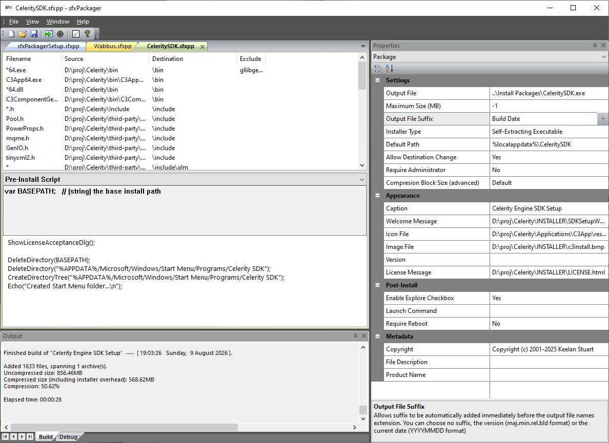
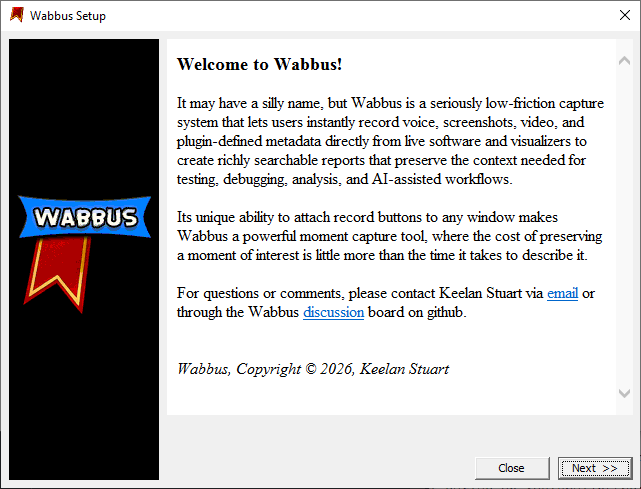
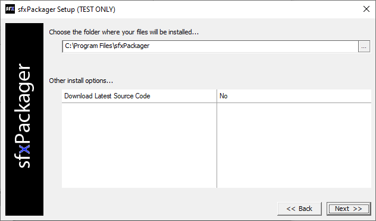
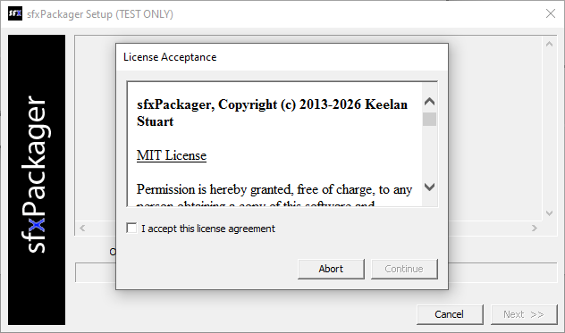

# sfxPackager

**A lightweight, scriptable installer and self-extracting package creator for Windows.**

Copyright © 2013-2026 Keelan Stuart

sfxPackager is a Windows installer creation tool designed around a simple idea: **building an installer shouldn't be harder than building the application it installs.**

Create a project, add your files, configure your package visually, and build. When you need more than the basics, sfxPackager includes an integrated JavaScript environment and installer API that let you customize installation behavior without giving up the simplicity of the project-based workflow.

The result is a **compact, self-contained Windows installer** that doesn't require your users to install a separate runtime, bootstrapper, or packaging framework.

## Why sfxPackager?

For straightforward applications, creating an installer can be almost entirely point-and-click. For complicated ones, the scripting system is there when you need it.

That combination lets sfxPackager stay simple without being simplistic.

Build your project once and rebuild it whenever your application changes. Files, installation paths, properties, scripts, license information, custom content, and other package settings remain part of the project rather than becoming another collection of build steps you have to reproduce.

<table>
  <tr>
    <td rowspan="3" width="65%" valign="middle" align="center">
      
      <b>sfxPackager project editor</b>
    </td>
    <td width="35%" valign="middle" align="center">
      
      <b>Custom HTML installer welcome screen</b>
    </td>
  </tr>
  <tr>
    <td valign="middle" align="center">
      
      <b>Script-defined installer options</b>
    </td>
  </tr>
  <tr>
    <td valign="middle" align="center">
      
      <b>License acceptance dialog</b>
    </td>
  </tr>
</table>

## Features

* **Self-contained installers** - Create compact Windows executables containing everything needed to install your application. By compact, I mean the installer .exe overhead is a mere 3.16 MB... and FastLZ payload compression strikes a perfect balance of size and speed concerns; sfxPackager is very efficient in time and space domains.

* **Project-based workflow** - Configure an installer once, then rebuild it as your application changes.

* **Build-system friendly** - Add directories dynamically at build time and invoke sfxPackager from the command line, allowing an .sfxpp project to become the final packaging step in your application's build.

* **Integrated JavaScript scripting** - JavaScript hooks for initialization, pre-install, pre-file, post-file, and post-install let you customize installation behavior from beginning to end. Scripts can manipulate files and the Registry, launch processes, create shortcuts, download content, perform license validation, and more.

* **"TEST ONLY" mode** - Run the complete installation process without making filesystem changes, making it easy to verify destinations and script behavior before deploying.

* **Drag-and-drop packaging** - Add and organize files without maintaining complicated packaging scripts or manifests.

* **Script-defined installer options** - Define custom properties in your initialization script and sfxPackager automatically exposes them to users in the configuration dialog; retrieve their values later during installation.

* **Dynamic paths** - Use Windows environment variables and Registry values when constructing installation paths.

* **Custom HTML content** - Supply your own welcome, license, and informational content either inline or from external files.

* **Remote package content** - Use URLs as file sources to download content at installation time rather than embedding everything in the package.

* **Code-signing compatible** - Generated installers are designed to support Windows Authenticode signing without interfering with embedded package data.

* **License validation support** - Built-in facilities help applications incorporate custom licensing and validation workflows.

* **Unicode throughout** - Designed for modern Windows applications and filenames.

* **Large package support** - Handle archives larger than 4 GB using external package data; fully self-contained installers support packages up to 4 GB.

* **Disk spanning** - Large installations can also be divided into explicitly sized package segments for distribution across multiple files or media.

## Getting Started

The easiest way to learn sfxPackager is to see it in action.

**[Watch the sfxPackager tutorial series on YouTube](https://www.youtube.com/playlist?list=PLaed72lE3UjgzdL1qOys-vxemSUOeGJWf)**

The tutorials walk through creating real packages and demonstrate both the basic workflow and the more advanced capabilities available through scripting.

For a more complete reference:

**[Read the sfxPackager User's Guide](sfxPackager_Users_Guide_v4.0.pdf)**

## Philosophy

sfxPackager is intended to occupy the space between two extremes: installer systems that are easy to use but difficult to customize, and overly-complicated installer frameworks that effectively require you to become an installer engineer.

**Start visually. Script what needs scripting. Build a small, self-contained installer.**

That's it.